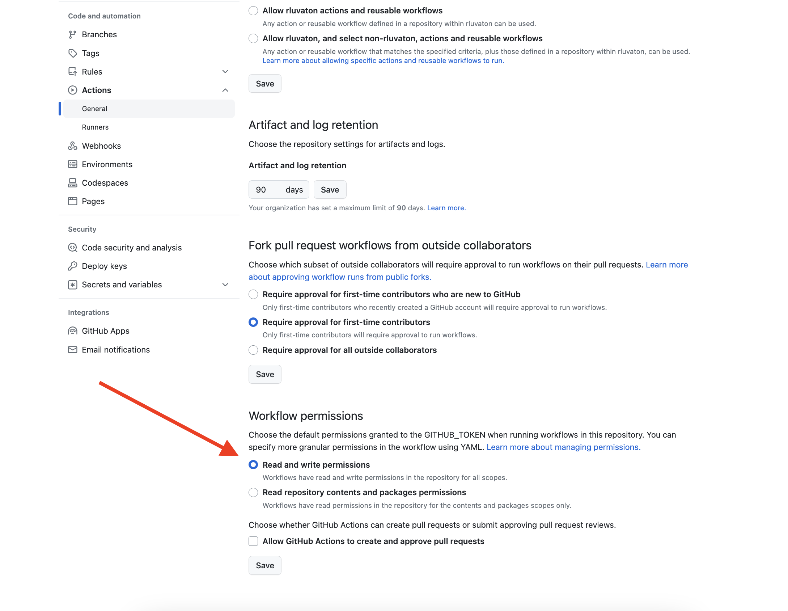

# NPM package Boilerplate

## Features:

- TypeScript
- Vitest
- ESLint
- Prettier
- Husky
- CommitLint
- CI in GitHub Action
- Auto Deploy to NPM using `semantic-release`

### Auto deploy to NPM

> If you want to remove it just delete the `deploy` job from the `.github/workflows/ci.yml` file

1. Update the url in the package.json file to the url of your repository (same for the issue)
2. Add the `NPM_TOKEN` variable to your GitHub secrets with the NPM token to publish

3. Enable
4. Select _Read and write permissions_ in the _Workflow permissions_ section in the _Settings_ → _Actions_ → _General_

